# AWS アーキテクチャ図

このCloudFormationテンプレートから構築されるAWSサービス群のアーキテクチャ図です。

## ASCII アート図解

```
┌─────────────────────────────────────────────────────────────────────────────┐
│                          インターネット                                        │
│  ┌──────────┐                    ┌──────────┐                              │
│  │  ユーザー  │                    │  GitHub   │                              │
│  └─────┬────┘                    └─────┬────┘                              │
│        │                                │                                    │
│        │ HTTPS/HTTP                     │ Webhook                            │
│        ▼                                ▼                                    │
└────────┼────────────────────────────────┼──────────────────────────────────┘
         │                                │
         │                                │
┌────────▼────────────────────────────────▼──────────────────────────────────┐
│                        Route 53 (DNS)                                       │
│  ┌────────────────────────────────────────────────────────────────────┐   │
│  │  ホストゾーン                                                         │   │
│  │  ┌──────────────┐  ┌──────────────┐                                │   │
│  │  │ Apex Domain  │  │  Subdomain   │                                │   │
│  │  │  (example.com)│  │(www.example.com)│                              │   │
│  │  └──────┬───────┘  └──────┬───────┘                                │   │
│  └─────────┼──────────────────┼───────────────────────────────────────┘   │
└────────────┼──────────────────┼───────────────────────────────────────────┘
             │                  │
             │ エイリアス        │
             ▼                  ▼
┌─────────────────────────────────────────────────────────────────────────────┐
│                    AWS Certificate Manager (ACM)                              │
│  ┌────────────────────────────────────────────────────────────────────┐     │
│  │                    SSL証明書 (HTTPS)                                 │     │
│  └────────────────────────────────────────────────────────────────────┘     │
└─────────────────────────────────────────────────────────────────────────────┘
             │
             │
┌────────────▼─────────────────────────────────────────────────────────────────┐
│                          VPC (10.0.0.0/16)                                    │
│                                                                               │
│  ┌─────────────────────────────────────────────────────────────────────┐   │
│  │                    パブリックサブネット (AZ-1, AZ-2)                  │   │
│  │  ┌──────────────────────────────────────────────────────────────┐  │   │
│  │  │  Application Load Balancer (ALB)                              │  │   │
│  │  │  ┌────────────┐  ┌────────────┐                              │  │   │
│  │  │  │ HTTPS:443 │  │ HTTP:80    │                              │  │   │
│  │  │  │ (SSL証明書)│  │ → HTTPS    │                              │  │   │
│  │  │  └─────┬─────┘  └─────┬──────┘                              │  │   │
│  │  └────────┼───────────────┼───────────────────────────────────────┘  │   │
│  └───────────┼───────────────┼───────────────────────────────────────────┘   │
│              │               │                                                 │
│              │ ルーティング   │                                                 │
│              ▼               ▼                                                 │
│  ┌─────────────────────────────────────────────────────────────────────┐   │
│  │                  プライベートサブネット (AZ-1, AZ-2)                  │   │
│  │  ┌──────────────────────────────────────────────────────────────┐  │   │
│  │  │  ECS クラスター                                                │  │   │
│  │  │  ┌────────────────────────────────────────────────────────┐  │  │   │
│  │  │  │  ECS サービス (Fargate)                                 │  │  │   │
│  │  │  │  ┌──────────────────────────────────────────────────┐ │  │  │   │
│  │  │  │  │  Rails アプリケーション コンテナ                  │ │  │  │   │
│  │  │  │  │  Port: 3000                                      │ │  │  │   │
│  │  │  │  └──────────────────────────────────────────────────┘ │  │  │   │
│  │  │  └────────────────────────────────────────────────────────┘  │  │   │
│  │  └──────────────────────────────────────────────────────────────┘  │   │
│  └─────────────────────────────────────────────────────────────────────┘   │
│              │                                                               │
│              │ MySQL:3306                                                    │
│              ▼                                                               │
│  ┌─────────────────────────────────────────────────────────────────────┐   │
│  │                  プライベートサブネット (DBサブネットグループ)        │   │
│  │  ┌──────────────────────────────────────────────────────────────┐  │   │
│  │  │  Aurora MySQL (Serverless v2)                                │  │   │
│  │  │  ┌──────────────┐          ┌──────────────┐                │  │   │
│  │  │  │ DB Instance 1│          │ DB Instance 2│                │  │   │
│  │  │  │   (AZ-1)     │          │   (AZ-2)     │                │  │   │
│  │  │  └──────────────┘          └──────────────┘                │  │   │
│  │  └──────────────────────────────────────────────────────────────┘  │   │
│  └─────────────────────────────────────────────────────────────────────┘   │
│                                                                               │
│  ┌─────────────────────────────────────────────────────────────────────┐   │
│  │                      VPC エンドポイント                               │   │
│  │  ┌──────────┐  ┌──────────┐  ┌──────────┐  ┌──────────┐         │   │
│  │  │ CloudWatch│  │  ECR     │  │ Secrets  │  │   SSM    │         │   │
│  │  │   Logs    │  │  Docker  │  │ Manager  │  │ Messages │         │   │
│  │  └──────────┘  └──────────┘  └──────────┘  └──────────┘         │   │
│  │  ┌──────────┐  ┌──────────┐                                      │   │
│  │  │  ECR API │  │ S3 Gateway│                                      │   │
│  │  └──────────┘  └──────────┘                                      │   │
│  └─────────────────────────────────────────────────────────────────────┘   │
└─────────────────────────────────────────────────────────────────────────────┘
         │                    │                    │                    │
         │                    │                    │                    │
         ▼                    ▼                    ▼                    ▼
┌─────────────────┐  ┌─────────────────┐  ┌─────────────────┐  ┌─────────────────┐
│  ECR リポジトリ   │  │ S3 アーティファクト│  │ S3 アクセスログ  │  │ Secrets Manager │
│  (Docker イメージ)│  │  (CodePipeline)  │  │   (ALB ログ)    │  │ (DB認証情報等)  │
└─────────────────┘  └─────────────────┘  └─────────────────┘  └─────────────────┘

┌─────────────────────────────────────────────────────────────────────────────┐
│                           CI/CD パイプライン                                  │
│                                                                               │
│  ┌──────────────┐      ┌──────────────┐      ┌──────────────┐            │
│  │ CodeStar     │─────▶│ CodePipeline │─────▶│  CodeBuild   │            │
│  │ Connection   │      │              │      │  (Docker ビルド)│            │
│  │ (GitHub接続)  │      │              │      └───────┬────────┘            │
│  └──────────────┘      └──────────────┘              │                     │
│                                                       │ イメージプッシュ      │
│                                                       ▼                     │
│                                              ┌─────────────────┐            │
│                                              │  ECR リポジトリ  │            │
│                                              └─────────────────┘            │
│                                                       │                     │
│                                                       │ デプロイ            │
│                                                       ▼                     │
│                                              ┌─────────────────┐            │
│                                              │  ECS サービス    │            │
│                                              └─────────────────┘            │
└─────────────────────────────────────────────────────────────────────────────┘

┌─────────────────────────────────────────────────────────────────────────────┐
│                          その他のサービス                                      │
│                                                                               │
│  ┌─────────────────┐          ┌─────────────────┐                           │
│  │ Lambda 関数     │          │  IAM ロール      │                           │
│  │ - スナップショット│          │ - ECS タスク     │                           │
│  │   検索          │          │ - ECS 実行      │                           │
│  │ - ネームサーバー │          │ - CodeBuild     │                           │
│  │   同期          │          │ - CodePipeline  │                           │
│  └─────────────────┘          │ - RDS 監視      │                           │
│                               └─────────────────┘                           │
└─────────────────────────────────────────────────────────────────────────────┘
```

## セキュリティグループの関係図

```
┌─────────────────────────────────────────────────────────────────────────────┐
│                          セキュリティグループ構成                              │
│                                                                               │
│  ┌─────────────────────┐                                                    │
│  │  ALB セキュリティグループ│                                                    │
│  │  Inbound: 0.0.0.0/0 │                                                    │
│  │  - Port 80 (HTTP)   │                                                    │
│  │  - Port 443 (HTTPS) │                                                    │
│  └──────────┬──────────┘                                                    │
│             │ 許可                                                           │
│             │ HTTP:80                                                        │
│             ▼                                                                 │
│  ┌─────────────────────┐                                                    │
│  │  ECS セキュリティグループ│                                                    │
│  │  Inbound: ALB SG    │                                                    │
│  │  - Port 3000        │                                                    │
│  └──────────┬──────────┘                                                    │
│             │ 許可                                                           │
│             │ MySQL:3306                                                     │
│             ▼                                                                 │
│  ┌─────────────────────┐                                                    │
│  │  DB セキュリティグループ │                                                    │
│  │  Inbound: ECS SG    │                                                    │
│  │  - Port 3306        │                                                    │
│  └─────────────────────┘                                                    │
│                                                                               │
│  ┌─────────────────────┐                                                    │
│  │ VPC エンドポイント SG │                                                    │
│  │  Inbound: ECS SG    │                                                    │
│  │  - Port 443 (HTTPS) │                                                    │
│  └─────────────────────┘                                                    │
└─────────────────────────────────────────────────────────────────────────────┘
```

## データフロー図

```
【ユーザーリクエストフロー】
┌────────┐
│ ユーザー │
└───┬────┘
    │ HTTPS/HTTP
    ▼
┌─────────────┐
│  Route 53   │ DNS解決
└───┬─────────┘
    │
    ▼
┌─────────────┐
│     ALB     │ SSL終端
└───┬─────────┘
    │ HTTP:80
    ▼
┌─────────────┐
│ ECS サービス │ Rails アプリ
└───┬─────────┘
    │ MySQL:3306
    ▼
┌─────────────┐
│ Aurora MySQL│
└─────────────┘

【CI/CD デプロイフロー】
┌────────┐
│ GitHub │ コードプッシュ
└───┬────┘
    │
    ▼
┌─────────────────┐
│ CodeStar        │ 接続
│ Connection      │
└───┬─────────────┘
    │
    ▼
┌─────────────────┐
│ CodePipeline    │ トリガー
└───┬─────────────┘
    │
    ├──▶ Source (GitHub)
    │
    ├──▶ Build (CodeBuild)
    │      │
    │      ├──▶ Docker ビルド
    │      │
    │      └──▶ ECR プッシュ
    │
    └──▶ Deploy (ECS)
           │
           └──▶ ECS サービス更新
```

## 全体アーキテクチャ図（Mermaid）

### Mermaid図の閲覧方法

このMermaid図は以下の方法で閲覧できます：

1. **GitHub/GitLab**: リポジトリにプッシュすると、Markdownファイル内で自動的にレンダリングされます
2. **VS Code / Cursor**:
   - [Markdown Preview Mermaid Support](https://marketplace.visualstudio.com/items?itemName=bierner.markdown-mermaid) 拡張機能をインストール
   - Markdownプレビューを開く（`Ctrl+Shift+V` / `Cmd+Shift+V`）
3. **Mermaid Live Editor**: [https://mermaid.live/](https://mermaid.live/) にコードをコピー＆ペースト
   - ※ `# AWS…` などのMarkdown本文を含めると `No diagram type detected...` が発生します。` ```mermaid` から始まるコード（`graph TB` 行以降）だけをコピーしてください
4. **その他のツール**:
   - [Obsidian](https://obsidian.md/)（Mermaid対応）
   - [Notion](https://www.notion.so/)（Mermaid対応）
   - [Typora](https://typora.io/)（Mermaid対応）

```mermaid
graph TB
    subgraph Internet["インターネット"]
        Users[ユーザー]
        GitHub[GitHub リポジトリ]
    end

    subgraph Route53["Route 53"]
        HostedZone[ホストゾーン]
        DNSRecords[DNS レコード<br/>Apex & Subdomain]
    end

    subgraph ACM["AWS Certificate Manager"]
        SSLCert[SSL証明書]
    end

    subgraph VPC["VPC (10.0.0.0/16)"]
        subgraph PublicSubnets["パブリックサブネット"]
            ALB[Application Load Balancer<br/>ALB]
        end

        subgraph PrivateSubnets["プライベートサブネット"]
            ECSCluster[ECS クラスター]
            ECSService[ECS サービス<br/>Fargate]
            ECSContainers[コンテナ<br/>Rails アプリ]
        end

        subgraph DatabaseSubnets["プライベートサブネット<br/>(DBサブネットグループ)"]
            AuroraCluster[Aurora MySQL<br/>Serverless v2<br/>最小0、最大2 ACU]
            DBInstance1[DB インスタンス 1<br/>AZ-1]
            DBInstance2[DB インスタンス 2<br/>AZ-2]
        end

        subgraph VPCEndpoints["VPC エンドポイント"]
            LogsEndpoint[CloudWatch Logs]
            ECRDkrEndpoint[ECR Docker]
            ECRAPIEndpoint[ECR API]
            SecretsEndpoint[Secrets Manager]
            SSMEndpoint[SSM Messages]
            S3Endpoint[S3 Gateway]
        end

        subgraph SecurityGroups["セキュリティグループ"]
            ALBSG[ALB SG<br/>80, 443]
            ECSSG[ECS SG<br/>3000]
            DBSG[DB SG<br/>3306]
            VPCEndpointSG[VPC Endpoint SG<br/>443]
        end
    end

    subgraph Storage["ストレージ"]
        ECR[ECR リポジトリ<br/>Docker イメージ]
        S3Artifacts[S3 バケット<br/>CodePipeline アーティファクト]
        S3AccessLogs[S3 バケット<br/>ALB アクセスログ]
    end

    subgraph Database["データベース"]
        SecretsManager[Secrets Manager<br/>DB認証情報<br/>Rails Master Key]
    end

    subgraph CICD["CI/CD パイプライン"]
        CodePipeline[CodePipeline]
        CodeBuild[CodeBuild<br/>Docker ビルド]
        CodeStarConnection[CodeStar Connection<br/>GitHub接続]
    end

    subgraph Lambda["Lambda 関数"]
        SnapshotLookup[スナップショット検索<br/>Lambda]
        NameserverSync[ネームサーバー同期<br/>Lambda]
    end

    subgraph IAM["IAM ロール"]
        ECSTaskRole[ECS タスクロール]
        ECSTaskExecRole[ECS タスク実行ロール]
        CodeBuildRole[CodeBuild ロール]
        CodePipelineRole[CodePipeline ロール]
        RDSMonitoringRole[RDS モニタリングロール]
    end

    %% ユーザーからのアクセス
    Users -->|HTTPS/HTTP| DNSRecords
    DNSRecords -->|エイリアス| ALB
    ALB -->|HTTPS:443| SSLCert
    ALB -->|HTTP:80 → HTTPS:443 リダイレクト| SSLCert
    ALB -->|ルーティング| ECSService

    %% ECS とコンテナ
    ECSService --> ECSContainers
    ECSContainers -->|DB接続| AuroraCluster
    ECSService --> ECSTaskRole
    ECSService --> ECSTaskExecRole
    ECSTaskExecRole --> SecretsManager

    %% セキュリティグループ接続
    ALB -.->|許可| ALBSG
    ECSService -.->|許可| ECSSG
    AuroraCluster -.->|許可| DBSG
    ALBSG -->|HTTP:80| ECSSG
    ECSSG -->|MySQL:3306| DBSG

    %% VPC エンドポイント接続
    ECSService --> LogsEndpoint
    ECSService --> ECRDkrEndpoint
    ECSService --> ECRAPIEndpoint
    ECSService --> SecretsEndpoint
    ECSService --> SSMEndpoint
    ECSService --> S3Endpoint
    LogsEndpoint -.->|許可| VPCEndpointSG
    ECRDkrEndpoint -.->|許可| VPCEndpointSG
    ECRAPIEndpoint -.->|許可| VPCEndpointSG
    SecretsEndpoint -.->|許可| VPCEndpointSG
    SSMEndpoint -.->|許可| VPCEndpointSG

    %% CI/CD パイプライン
    GitHub -->|Webhook| CodeStarConnection
    CodeStarConnection --> CodePipeline
    CodePipeline -->|Source| CodeStarConnection
    CodePipeline -->|Build| CodeBuild
    CodeBuild --> CodeBuildRole
    CodeBuild -->|プッシュ| ECR
    CodePipeline -->|Deploy| ECSService
    CodePipeline --> CodePipelineRole
    CodeBuild --> S3Artifacts
    CodePipeline --> S3Artifacts

    %% ECR から ECS へのイメージ取得
    ECSService -->|イメージ取得| ECRDkrEndpoint
    ECRDkrEndpoint --> ECR

    %% ストレージ接続
    ALB -->|アクセスログ| S3AccessLogs
    ECSService -->|ログ送信| LogsEndpoint

    %% データベース関連
    AuroraCluster --> DBInstance1
    AuroraCluster --> DBInstance2
    AuroraCluster --> RDSMonitoringRole
    AuroraCluster --> SecretsManager
    SnapshotLookup -->|スナップショット検索| AuroraCluster

    %% DNS 関連
    HostedZone --> DNSRecords
    NameserverSync --> HostedZone
    SSLCert --> HostedZone

    %% スタイル設定
    classDef network fill:#e1f5ff,stroke:#01579b,stroke-width:2px
    classDef compute fill:#fff3e0,stroke:#e65100,stroke-width:2px
    classDef storage fill:#f3e5f5,stroke:#4a148c,stroke-width:2px
    classDef database fill:#e8f5e9,stroke:#1b5e20,stroke-width:2px
    classDef security fill:#ffebee,stroke:#b71c1c,stroke-width:2px
    classDef cicd fill:#fff9c4,stroke:#f57f17,stroke-width:2px

    class VPC,PublicSubnets,PrivateSubnets,DatabaseSubnets,VPCEndpoints network
    class ECSCluster,ECSService,ECSContainers,ALB compute
    class ECR,S3Artifacts,S3AccessLogs storage
    class AuroraCluster,DBInstance1,DBInstance2,SecretsManager database
    class SecurityGroups,ALBSG,ECSSG,DBSG,VPCEndpointSG security
    class CodePipeline,CodeBuild,CodeStarConnection cicd
```



## リソース一覧

### ネットワークリソース
- **VPC**: 10.0.0.0/16
- **パブリックサブネット**: 2つ（AZ-1, AZ-2）
- **プライベートサブネット**: 2つ（AZ-1, AZ-2）
- **インターネットゲートウェイ**: パブリックサブネット用
- **ルートテーブル**: パブリック用1つ、プライベート用2つ

### コンピューティングリソース
- **ECS クラスター**: Fargate/Fargate Spot対応
- **ECS サービス**: プライベートサブネットで実行
- **ECS タスク定義**: Rails アプリケーションコンテナ

### ロードバランサー
- **Application Load Balancer**: パブリックサブネット
- **ターゲットグループ**: ECS サービス向け（HTTP:80、コンテナはPort 3000でリッスン）
- **リスナー**: HTTPS (443) と HTTP (80 → HTTPS リダイレクト)

### データベース
- **Aurora MySQL**: Serverless v2（最小0、最大2 ACU）
- **DB インスタンス**: 2つ（マルチAZ構成）
- **DB サブネットグループ**: プライベートサブネットを使用

### ストレージ
- **ECR リポジトリ**: Docker イメージ保存
- **S3 バケット（アーティファクト）**: CodePipeline用
- **S3 バケット（アクセスログ）**: ALB アクセスログ用

### DNS・証明書
- **Route 53 ホストゾーン**: ドメイン管理
- **ACM SSL証明書**: HTTPS用
- **DNS レコード**: Apex ドメインとサブドメイン

### CI/CD
- **CodePipeline**: ソース → ビルド → デプロイ
- **CodeBuild**: Docker イメージビルド
- **CodeStar Connection**: GitHub接続

### セキュリティ
- **セキュリティグループ**: ALB、ECS、DB、VPCエンドポイント用
- **Secrets Manager**: DB認証情報、Rails Master Key
- **VPC エンドポイント**: Logs、ECR、Secrets Manager、SSM、S3

### Lambda 関数
- **スナップショット検索**: 最新DBスナップショット自動検索
- **ネームサーバー同期**: Route 53 ネームサーバー自動更新

### IAM ロール
- **ECS タスクロール**: アプリケーション実行用
- **ECS タスク実行ロール**: コンテナ起動・Secrets取得用
- **CodeBuild ロール**: ビルド・ECRプッシュ用
- **CodePipeline ロール**: パイプライン実行用
- **RDS モニタリングロール**: データベース監視用

## データフロー

### ユーザーリクエストフロー
1. ユーザー → Route 53 DNS → ALB
2. ALB → ECS サービス（プライベートサブネット）
3. ECS コンテナ → Aurora MySQL（プライベートサブネット）

### CI/CD フロー
1. GitHub にプッシュ → CodeStar Connection → CodePipeline
2. CodePipeline → CodeBuild（Docker ビルド）
3. CodeBuild → ECR にイメージプッシュ
4. CodePipeline → ECS サービス更新（新イメージデプロイ）

### ログ・モニタリングフロー
- ALB アクセスログ → S3 バケット
- ECS コンテナログ → CloudWatch Logs（VPCエンドポイント経由）
- RDS メトリクス → CloudWatch（RDSモニタリングロール経由）
